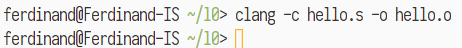
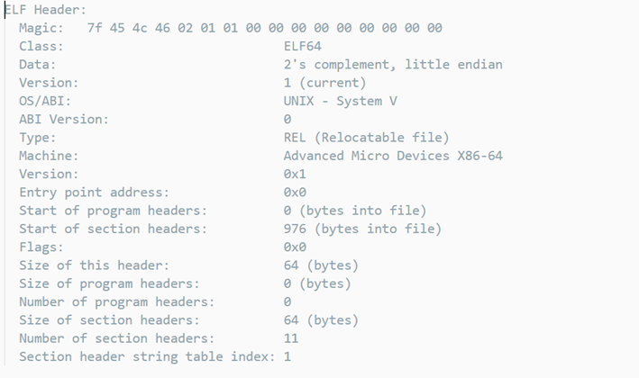

{width="2.5076388888888888in" height="0.4618055555555556in"}

**计算机系统**

**大作业**

题 目 [ 程序人生-Hello's P2P ]

专 业 [ 计算机类 ]

学　　 号 [ 1180300303 ]

班　　 级 [ 1836101/1803003 ]

学 生 [ 宿梓航 ]

指 导 教 师 [ 刘宏伟]

**计算机科学与技术学院**

**2019年12月**

**摘 要**

本文以在作为Windows子系统的Linux环境(WSL)下，分四步（预处理，编译，汇编，链接）编译了简单程序hello，如此通过探索Hello的Program到Process(Hello's P2P)过程，研究了程序的诞生过程（编译）。之后又研究Hello的从装载、执行到信号、退出等的整个0to0的进程生命周期，进而探索了操作系统对于内存、IO、进程的管理过程。

**关键词：**编译；操作系统；WSL；

**（摘要0分，缺失-1分，根据内容精彩称都酌情加分0-1分）**

# 目录

[[第1章 概述] - 4 -](#第1章-概述)

[[1.1 Hello简介] - 4 -](#hello简介)

[[1.2 环境与工具] - 4 -](#环境与工具)

[[1.2.1 硬件环境] - 4 -](#硬件环境)

[[1.2.2 软件环境] - 4 -](#软件环境)

[[1.2.3 开发工具] - 5 -](#开发工具)

[[1.3 中间结果] - 5 -](#中间结果)

[[1.4 本章小结] - 5 -](#本章小结)

[[第2章 预处理] - 6 -](#第2章-预处理)

[[2.1 预处理的概念与作用] - 6 -](#预处理的概念与作用)

[[2.2在Ubuntu下预处理的命令] - 6 -](#在ubuntu下预处理的命令)

[[2.3 Hello的预处理结果解析] - 6 -](#hello的预处理结果解析)

[[2.4 本章小结] - 6 -](#本章小结-1)

[[第3章 编译] - 8 -](#第3章-编译)

[[3.1 编译的概念与作用] - 8 -](#编译的概念与作用)

[[3.2 在Ubuntu下编译的命令] - 8 -](#在ubuntu下编译的命令)

[[3.3 Hello的编译结果解析] - 8 -](#hello的编译结果解析)

[[3.4 本章小结] - 13 -](#本章小结-2)

[[第4章 汇编] - 14 -](#第4章-汇编)

[[4.1 汇编的概念与作用] - 14 -](#汇编的概念与作用)

[[4.2 在Ubuntu下汇编的命令] - 14 -](#在ubuntu下汇编的命令)

[[4.3 可重定位目标elf格式] - 14 -](#可重定位目标elf格式)

[[4.4 Hello.o的结果解析] - 16 -](#hello.o的结果解析)

[[4.5 本章小结] - 16 -](#本章小结-3)

[[第5章 链接] - 17 -](#第5章-链接)

[[5.1 链接的概念与作用] - 17 -](#链接的概念与作用)

[[5.2 在Ubuntu下链接的命令] - 17 -](#在ubuntu下链接的命令)

[[5.3 可执行目标文件hello的格式] - 17 -](#可执行目标文件hello的格式)

[[5.4 hello的虚拟地址空间] - 18 -](#hello的虚拟地址空间)

[[5.5 链接的重定位过程分析] - 18 -](#链接的重定位过程分析)

[[5.6 hello的执行流程] - 20 -](#hello的执行流程)

[[5.7 Hello的动态链接分析] - 21 -](#hello的动态链接分析)

[[5.8 本章小结] - 22 -](#本章小结-4)

[[第6章 hello进程管理] - 23 -](#第6章-hello进程管理)

[[6.1 进程的概念与作用] - 23 -](#进程的概念与作用)

[[6.2 简述壳Shell-bash的作用与处理流程] - 23 -](#简述壳shell-bash的作用与处理流程)

[[6.3 Hello的fork进程创建过程] - 23 -](#hello的fork进程创建过程)

[[6.4 Hello的execve过程] - 24 -](#hello的execve过程)

[[6.5 Hello的进程执行] - 24 -](#hello的进程执行)

[[6.6 hello的异常与信号处理] - 25 -](#hello的异常与信号处理)

[[6.7本章小结] - 29 -](#本章小结-5)

[[第7章 hello的存储管理] - 30 -](#第7章-hello的存储管理)

[[7.1 hello的存储器地址空间] - 30 -](#hello的存储器地址空间)

[[7.2 Intel逻辑地址到线性地址的变换-段式管理] - 30 -](#intel逻辑地址到线性地址的变换-段式管理)

[[7.3 Hello的线性地址到物理地址的变换-页式管理] - 30 -](#hello的线性地址到物理地址的变换-页式管理)

[[7.4 TLB与四级页表支持下的VA到PA的变换] - 31 -](#tlb与四级页表支持下的va到pa的变换)

[[7.5 三级Cache支持下的物理内存访问] - 32 -](#三级cache支持下的物理内存访问)

[[7.6 hello进程fork时的内存映射] - 33 -](#hello进程fork时的内存映射)

[[7.7 hello进程execve时的内存映射] - 33 -](#hello进程execve时的内存映射)

[[7.8 缺页故障与缺页中断处理] - 34 -](#缺页故障与缺页中断处理)

[[7.9动态存储分配管理] - 35 -](#动态存储分配管理)

[[7.10本章小结] - 36 -](#本章小结-6)

[[第8章 hello的IO管理] - 37 -](#第8章-hello的io管理)

[[8.1 Linux的IO设备管理方法] - 37 -](#linux的io设备管理方法)

[[8.2 简述Unix IO接口及其函数] - 37 -](#简述unix-io接口及其函数)

[[8.3 printf的实现分析] - 38 -](#printf的实现分析)

[[8.4 getchar的实现分析] - 40 -](#getchar的实现分析)

[[8.5本章小结] - 40 -](#本章小结-7)

[[结论] - 40 -](#结论)

[[附件] - 42 -](#附件)

[[参考文献] - 43 -](#参考文献)

#  第1章 概述

## 1.1 Hello简介

> 编写hello.c（Program）后，运行编译器进行预处理、编译、汇编、链接等过程，生成可执行文件hello。
>
> Shell通过fork函数调用OS（进程管理）产生一个子进程，然后利用execve函数对hello可执行文件进行内存映射，并通过进程管理分配给hello的代码一定的CPU时间，然后可以使得hello在Hardware(CPU/RAM/IO)上运行（取指译码执行/流水线等）；这时的Hello是一个进程(Progress)。这便是P2P。
>
> OS（存储管理）与MMU为需要将代码中描述的VA转换为PA来进行内存访问；TLB、4级页表、3级Cache，Pagefile等等为程序运行时的储存访问加速；IO管理与信号处理，以软硬件相结合的方式，才使Hello能在键盘、主板、显卡、屏幕间流畅的运行。在运行结束后，被hello占用的资源又会被操作系统回收，这就是020

## 1.2 环境与工具

列出你为编写本论文，折腾Hello的整个过程中，使用的软硬件环境，以及开发与调试工具。

### 1.2.1 硬件环境

Intel Core i7-8750H, 2.2GHz

16G RAM

Samsung SSD 970 PRO 1TB

### 1.2.2 软件环境

Windows 10 1903 x64

Ubuntu 18.04.2 LTS(4.4.0-18362-Microsoft)

Windows Subsystem for Linux

zsh 5.4.2

VcXsrv X Server 1.20.5.1

### 1.2.3 开发工具

Visual Studio Code 1.41.1

clang version 6.0.0-1ubuntu2

GNU nano 2.9.3

Edb 1.1.0

## 1.3 中间结果

列出你为编写本论文，生成的中间结果文件的名字，文件的作用等。

  hello.c             hello的c源文件
------------------- ----------------------------
  hello.i             预处理后的源代码
  hello.s             编译生成的汇编程序
  hello.o             汇编生成的可重定位目标文件
  hello.objdump       hello.o用objdump处理的输出
  hello.readelf       hello.o用readelf处理的输出
  hello               链接生成的可执行文件
  hello.exe.objdump   hello用objdump处理的输出
  hello.exe.readelf   hello用readelf处理的输出

## 1.4 本章小结

本章简单地介绍了hello及其P2P和020的过程，然后列出了完成本文的环境和工具，阐明了编写本论文时出现的中间文件及其作用。

**（第1章0.5分）**

#  第2章 预处理

## 2.1 预处理的概念与作用

预处理器（cpp）根据以字符\#开头的命令，修改原始的C程序。这些命令通常是.c文件开头的一些以\#include命令。这些命令告诉预处理器读取哪些相应的头文件，之后把这些文件直接插入程序文本中，就得到了另一个C程序，通常是以.i作为文件扩展名。

## 2.2在Ubuntu下预处理的命令

> {width="3.8419991251093615in" height="0.4417049431321085in"}

应截图，展示预处理过程！

> {width="5.90625in" height="3.16875in"}

## 2.3 Hello的预处理结果解析

预处理后，hello.c变为hello.i文件。定义的宏已经被展开，头文件中的内容被包含进该文件中，代码行数由29行变为3096行。内容增加，且仍是C语言程序文本文件。

## 2.4 本章小结

本章里，我们对hello.c进行了预处理。利用指令clang -E hello.c -o hello.i可以将其转换为.i文件。之后我们可以进行汇编。

**（第2章0.5分）**

#  第3章 编译

## 3.1 编译的概念与作用
编译器（ccl）将文本文件hello.i翻译成hello.s，包含一个汇编语言程序，其中包含一个汇编语言程序。

本质上，编译就是把高级语言的源程序翻译成汇编程序。

> 注意：这儿的编译是指从 .i 到 .s 即预处理后的文件到生成汇编语言程序

## 3.2 在Ubuntu下编译的命令

> {width="5.90625in" height="0.5715277777777777in"}

应截图，展示编译过程！

## 3.3 Hello的编译结果解析

3.3.1 数据

3.3.1.1 全局变量

Hello.c只包含一个全局变量。

> {width="2.100181539807524in" height="0.2750240594925634in"}

> {width="5.675492125984252in" height="1.466793525809274in"}

编译后，被放在.data节中；同时，因为被声明为int，它的值不是2.5，而是2（这也是前面编译时Warning的来历）

3.3.1.2 局部变量

在main中存在局部变量i，argc，argv

其中int i 存放在栈上 -20(%rbp)

另两者作为参数,

int argc存放在寄存器rdi中，

char\* argv\[\] 存放在寄存器rsi中

3.3.1.3 常量

Main函数中的两个字符串常量

\"Usage: Hello 学号 姓名！\\n\"

\"Hello %s %s\\n\"

均被放置在.rodata节中.

> {width="5.90625in" height="2.765277777777778in"}

3.3.1.4 表达式

共有两个比较表达式argc!=3和i\<10

它们分别由如下的汇编语句计算:

> {width="2.5418864829396326in" height="0.2500218722659667in"}

> {width="2.5835575240594926in" height="0.2416874453193351in"}

3.3.1.5 类型

共涉及到三个类型:char\*,char\*\*和int型

前两者均属于指针型,所以长度都为8,在汇编语句中的操作以q为后缀;

Int长度为4,操作以l为后缀

3.3.1.6 宏

Hello.c中没有发现可扩展的宏.

3.3.2 赋值

3.3.2.1 =

全局变量的赋值是直接写在可执行文件里的;

Int i的赋值是通过movl一个立即数实现的.

i的声明(不赋初始值)由

> {width="1.9418350831146107in" height="0.21668525809273842in"}

直接完成.

赋值则是

> {width="2.9419214785651793in" height="0.2583552055993001in"}

3.3.2.2 逗号操作符

Hello.c中的逗号只用于参数的分隔.

3.3.3 类型转换

> {width="1.991839457567804in" height="0.3166940069991251in"}

只有此处,double 2.5被隐式转换为int;没有使用显示转换.

3.3.4 sizeof

没有使用此操作符.

3.3.5 算术操作

-   循环中的算术操作;

> 被这样完成
>
> {width="2.5668886701662292in" height="0.7750667104111986in"}
>
> 3.3.6 逻辑/位操作
>
> 没有出现.
>
> 3.3.7关系操作
>
> 已在3.3.1.4中说明,不再赘述.
>
> 3.3.8数组/指针/结构操作

数组操作是相邻的两处:

> {width="1.6084722222222223in" height="0.2416874453193351in"}

被转化为相对寻址过程.

> {width="2.5002165354330708in" height="0.9500820209973754in"}

3.3.9控制转移

3.3.9.1 if块

> {width="4.267036307961505in" height="1.3084470691163606in"}

被编译器转化为cmpl+je+标签的形式

> {width="5.90625in" height="2.073611111111111in"}

3.3.9.2 for循环

> {width="4.700406824146982in" height="1.2501082677165354in"}

被转化成cmpl+jmp的形式.

> {width="5.90625in" height="4.092361111111111in"}

3.3.10 函数操作

共五次函数调用

> {width="3.8836701662292215in" height="0.5083770778652669in"}

> {width="4.217031933508311in" height="0.4583727034120735in"}

> {width="1.2251060804899387in" height="0.26668963254593175in"}

3.3.10.1 参数传递

前四次调用有参数传递,实际上是用mov把实参拷贝到形参对应位置的寄存器上.

第一次printf

> {width="2.3583311461067367in" height="0.26153871391076117in"}

第二次exit

> {width="1.9501695100612424in" height="0.2416874453193351in"}

第三次printf

> {width="2.966923665791776in" height="1.258442694663167in"}

第四次sleep

> {width="2.516884295713036in" height="0.21668525809273842in"}

3.3.10.2 函数调用

利用callq完成,但是call之前可能要保存寄存器.

第一次

> {width="1.6418088363954506in" height="0.2416874453193351in"}

第二次

> {width="2.516884295713036in" height="0.4833748906386702in"}

第三次

> {width="1.825158573928259in" height="0.19168307086614172in"}

第四次

> {width="2.783575021872266in" height="0.49170931758530184in"}

第五次

> {width="2.383540026246719in" height="0.2500218722659667in"}

3.3.10.3 函数返回

恢复栈指针和帧指针,然后retq即可.

> {width="2.7002340332458443in" height="0.7750667104111986in"}

## 3.4 本章小结

此外，完成该阶段转换后，可以进行下一阶段的汇编处理。

本章里，我们对hello.i进行了编译。利用指令clang -S hello.i -o hello.s可以将其转换为汇编程序.s文件。本章还通过与原高级语言程序文件与汇编程序文件的比较进行比较，完成了对编译器任务的解析。

**（第3章2分）**

#  第4章 汇编

## 4.1 汇编的概念与作用

由汇编器（as）将.s文件翻译成为机器语言指令，把这些指令打包成一种叫做可重定位目标程序的格式，并把结果保存在目标文件.o中的过程,叫做汇编。

Hello.o是一个二进制文件.

汇编的左右在于把对人类友好的文本文件程序,转化为机器友好的机器代码.

## 4.2 在Ubuntu下汇编的命令

> {width="3.850333552055993in" height="0.4000349956255468in"}

## 4.3 可重定位目标elf格式

4.3.1 ELF头

> {width="5.90625in" height="3.50625in"}

ELF头以一个16字节的序列开始，这个序列描述了生成该文件的系统的字的大小和字节顺序。

ELF头剩下的部分包含帮助链接器语法分析和解释目标文件的信息,包括ELF头的大小、目标文件的类型、机器类型、字节头部表的文件偏移，以及节头部表中条目的大小和数量等信息。

根据文件头的信息，可以知道该文件是可重定位目标文件，含有11个节.

4.3.2 节头表

> {width="5.90625in" height="2.0256944444444445in"}

节头表中描述了不同节的位置和大小，目标文件中的每个节都有一个固定大小的条目。

由于是可重定位目标文件，所以每个节都从0开始，方便进行重定位。

在文件头中得到节头表的信息，然后再使用节头表中的字节偏移信息,可以得到各节在文件中的起始位置，以及各节所占空间的大小。

同时可知，.text是可执行的，但是不能写；.data和.rodata都不可执行，.rodata也不可写。

4.3.3 .rela.text

> {width="5.90625in" height="1.6465277777777778in"}

重定位节.rela.text是包含.text节中位置的列表，列出了.text节中需要进行重定位的信息，当链接器把这个目标文件和其他文件组合时，需要修改这些位置。图中8条重定位信息是printf中的两个常量字符串,printf函数,exit函数,sleepsecs,sleep函数,getchar函数进行的重定位声明。

4.3.4 .symtab

> {width="5.90625in" height="2.308333333333333in"}

符号表记录了使用编译器输出到汇编语言.s文件中的符号.

## 4.4 Hello.o的结果解析

> {width="4.633734689413823in" height="0.37503280839895015in"}

然后将该反汇编结果与hello.s的进行对照:

> {width="5.90625in" height="3.16875in"}

通过比较, 两份程序的差异之处主要是:

1.  反汇编代码不再有伪指令和位置标签, 取而代之的是一些绝对或者相对位置引用

2.  反汇编代码中,十进制立即数全都换成了16进制

3.  反汇编中的部分指令(mov)和原汇编有所不同.

## 4.5 本章小结

在本章, 我们利用汇编器把汇编代码程序汇编成可重定位的目标文件. 然后通过readelf读取了可重定位目标文件的相关信息, 再用objdump反汇编,并与原汇编文件进行了对比.

**（第4章1分）**

#  第5章 链接

## 5.1 链接的概念与作用

链接器将不同的目标文件（包括本项目的，各种裤库的）合并为一个完整的，可以直接装入内存执行的可执行程序。链接分为两个步骤，一是符号解析，二是重定位。在符号解析时，链接器将每个符号引用与一个确定的符号定义关联起来。然后将多个目标文件中单独的代码节和数据节合并为单文件的各种节。重定位时，将符号从它们的在.o文件的相对位置重新定位到可执行文件的最终绝对内存位置。更新所有对这些符号的引用来更新它们的新位置。

## 5.2 在Ubuntu下链接的命令

> {width="4.20869750656168in" height="2.1918569553805773in"}

使用ld的链接命令，应截图，展示汇编过程！ 注意不只连接hello.o文件

## 5.3 可执行目标文件hello的格式

阅读节头表即可获得各段的起始地址(Address)，大小(Size)等信息：

> {width="5.90625in" height="3.16875in"}

## 5.4 hello的虚拟地址空间

> {width="5.90625in" height="3.16875in"}

使用edb加载hello，即可查看本进程的虚拟地址空间各段信息；

以最容易分辨的.rodata段为例，如图，.rodata段的数据映射到了期待的位置和大小。其它的段依此类推。

## 5.5 链接的重定位过程分析

5.5.1 反汇编结果分析

> {width="5.90625in" height="3.16875in"}

> {width="5.90625in" height="3.16875in"}

如图对比hello(左)和hello.o的反汇编结果。主要区别体现在：

1.  hello中，文件以.init开始，而非.text开始

2.  各种地址有所变化

3.  加入了链接进的函数

4.  彻底没有了'.'开头的伪指令

5.5.2 链接的过程

5.5.2.1符号解析

在这个阶段，链接器将每个符号引用与各个可重定位目标文件的符号表中的一个确定的符号定义关联起来。

对于那些本地符号引用，符号解析十分容易。然而对于外部引用，链接器需要按照命令行给出的顺序扫描给出的.o文件和.a文件。然后如果扫描到最后，还有未被解析的符号，则发生链接错误。

5.5.2.2重定位

首先将待链接的所有目标文件中相同的节合并成新节，然后，链接器将虚拟内存地址赋予合成的节和每个符号，再对引用符号的位置进行更新(重定位)。

例如：符号.rodata.str1.1被重定位在\$0x400618的位置。

> {width="5.90625in" height="0.40347222222222223in"}

## 5.6 hello的执行流程

> {width="5.90625in" height="3.16875in"}

单步执行hello，获得如下执行顺序（因为MSWORD的拼写检查问题所以截图呈现）

> {width="4.908758748906386in" height="5.508811242344707in"}

## 5.7 Hello的动态链接分析

\_dl\_init前：

> {width="6.154156824146981in" height="2.1in"}

\_dl\_init后：

> {width="6.250033902012248in" height="1.9307688101487315in"}

可以看到.got节(00000000:00600ff0起始)的数据发生了变化

> {width="5.90625in" height="0.10833333333333334in"}

## 5.8 本章小结

在本章, 我们利用链接器把可重定位的目标文件链接成了一个完整的可执行文件，然后通过readelf读取了ELF可执行文件的相关信息, 再用objdump反汇编,并与原可执行目标文件的反汇编文件进行了对比；通过edb工具查看虚拟内存映射、执行流程、动态链接过程。

**（第5章1分）**

#  第6章 hello进程管理

## 6.1 进程的概念与作用

进程是一个正在运行的程序实例。是系统进行资源分配和调度的基本单位，是操作系统结构的基础。

进程方便了操作系统对资源的管理。通过上下文切换和虚拟内存，当前的程序程序好像是系统中当前运行的唯一程序一样，流畅地执行着。。

## 6.2 简述壳Shell-bash的作用与处理流程

Shell的作用：

操作系统外壳提供用户与内核的交互接口。它接收用户输入的命令并把它送入内核去执行

Shell是一个命令解释器，它解释由用户输入的命令并且把它们送到内核。，Shell也有自己的编程语言用于对命令的编辑，它允许用户编写由shell命令组成的程序。 

Shell的处理流程

1.  shell首先检查命令是否是内部命令，

2.  若不是再检查是否是一个应用程序。然后shell在Path里寻找程序。

3.  如果键入的命令不是一个内部命令并且在路径里没有找到这个可执行文件，将会显示一条错误信息。

4.  如果能够成功找到命令，该内部命令或应用程序将被分解为系统调用并传给Linux内核。

## 6.3 Hello的fork进程创建过程

当用户通过shell启动hello时，shell调用fork函数创建一个子进程，该子进程除了PID以外，几乎与父进程完全一致，有着完全相同结构但是实际上独立的虚拟内存空间。在fork返回的瞬间，这个虚拟空间的内容也完全相同。

在输入./hello命令后，shell调用fork函数创建一个子进程，之后内核为hello进程创建各种数据结构，并分配给它们一个唯一的PID。同时，内核还将把两个进程的内存各个区域标记为私有的写时复制。

Fork在父进程与新产生的子进程中都会返回一次，在父进程中返回子进程PID，在子进程中返回0.

## 6.4 Hello的execve过程

Fork后的子进程会调用execve函数，加载并运行hello；并且将参数列表argv和环境变量列表envp传递给hello的main函数。仅当出现错误时，如文件未找到时，execve才会返回到子进程中。在execve加载了Hello之后，它调用初始化代码来设置栈，然后将控制传递给main函数。

> {width="5.8838429571303585in" height="4.683739063867017in"}

## 6.5 Hello的进程执行

上下文信息：

上下文就是内核重新启动一个被抢占的进程所需的状态。它由一些对象的值构成，这些对象包括通用目的寄存器、浮点寄存器、程序计数器、用户栈、状态寄存器、内核栈和各种内核数据结构，比如描述地址空间的页表、包含有关当前进程信息的进程表，以及包含进程已经打开文件信息的文件表。

对于hello程序的执行，当用户由其它程序切入hello时，先进入内核态，hello的上下文被恢复，之后才进入用户态运行；切出hello时，会先由用户态变为内核态，保存上下文。

调度：在进程执行的某些时刻，内核可以决定抢占当前进程，并重新开始一个先前被抢占了的进程，这种决策就叫调度。

进程时间片：

是分时操作系统分配给每个正在运行的进程的一段CPU时间。

对于hello程序的执行，当用户由其它程序切入hello时，操作系统就会分给它时间片。

Hello运行时：

Hello在内核态被装入内存，之后运行在用户模式中，当调用sleep函数时，内核进行调度执行上下文切换，hello进入内核模式，内核将上下文控制权交给其他进程，计时器开始计时。当时间到两秒后，定时器发送中断信号到CPU引脚，CPU调用内核程序执行中断处理，又将上下文的控制权交回hello，hello继续运行。

## 6.6 hello的异常与信号处理

hello在执行的过程中，共会遇到四种异常：外部设备引起的中断，执行指令导致的陷阱、故障和终止。中断属于异步异常，最常见的是外部设备的I/O中断。其它的属于同步异常。陷阱是有意产生的异常，最常见的是系统调用。故障是非有意产生，但是可能被修复的异常，如缺页故障；而终止是非故意产生的不可修复的致命错误。

在发生异常时，内核会发送信号给相应进程。例如程序进行非法内存访问，内核就发送SIGSEGV信号给它。常见信号种类和处理方式如下：

> {width="5.225452755905512in" height="5.025435258092738in"}

不停乱按:

第一个回车符以前的输入，被通过中断的方式输入，最终发送给程序。程序执行getchar()读取这些输入的第一个字符之后退出，然后内核发送SIGCHLD给zsh。此后的输入，则由zsh接收，并被视为无效命令。

> {width="5.90625in" height="6.086111111111111in"}

回车：

回车符通过中断的方式输入，最终发送给程序。程序执行getchar()读取这回车符之后退出，然后内核发送SIGCHLD给zsh。

> {width="3.9923075240594925in" height="2.2205730533683288in"}

\^C：

键盘中断信号SIGINT被内核发送给hello，hello收到后立即终止。之后zsh受到SIGCHLD信号。

> {width="5.083774059492564in" height="0.7750667104111986in"}

\^Z:

键盘发送SIGTSTP信号给hello，hello收到后立即停止，之后zsh受到SIGCHLD信号，更新hello状态为挂起并显示。

> {width="5.425470253718285in" height="1.0584251968503937in"}

ps:

ps查看当前执行的进程和开始时间。

> {width="3.915384951881015in" height="1.8090879265091864in"}

jobs:

jobs查看当前挂起的进程。

> {width="4.65873687664042in" height="0.5500481189851268in"}

pstree:

查看进程树

> {width="5.90625in" height="2.4319444444444445in"}

Fg,\^Z,kill:

Fg指令发送SIGCONT信号给hello使得hello继续在前台执行

\^Z则发送SIGTSTP将hello再次挂起

最后kill发送SIGKILL终止hello

> {width="5.050437445319335in" height="2.666897419072616in"}

## 6.7本章小结

本阶段通过在shell中运行hello，然后在运行hello的过程中执行了各种操作，回顾了与操作系统相关的如信号、异常等知识，计算机硬件、操作系统（外壳和内核）以及应用程序之间的配合和协作的形式。

**（第6章1分）**

#  第7章 hello的存储管理

## 7.1 hello的存储器地址空间

a.  逻辑地址是机器语言中指向一个操作数或一条指令的地址。每一个逻辑地址都由一个段和偏移量组成，偏移量指明了从段开始的地方到实际地址之间的距离。在hello中，就是hello里各个元素的相对偏移地址。

b.  线性地址是逻辑地址到物理地址变换之间的中间层。程序代码会产生逻辑地址，再加上相应段的基地址就生成了一个线性地址。对于hello而言，就是hello中的虚拟内存地址。

c.  虚拟地址是包含虚拟内存的操作系统中，对应一个虚拟内存单元的地址。在hello中，虚拟地址就是线性地址。

d.  物理地址是对应在物理储存器中储存位置的地址。hello运行时的地址翻译会将hello的一个虚拟地址转化为物理地址。

## 7.2 Intel逻辑地址到线性地址的变换-段式管理

一个逻辑地址是由一个段标识符加上一个指定段内相对地址的偏移量构成，表示为\[段标识符：段内偏移量\]。先根据段标识符最低位，判断当前要转换的时是全局段描述符表中的段，还是局部段描述符表中的段；再根据相应寄存器得到其地址和大小。之后再用段选择符中剩余前13位的索引在相应的数组中查找到对应的段描述符，这样就找到了它的基地址。基地址 + 段内偏移量就是要转换成的线性地址。

## 7.3 Hello的线性地址到物理地址的变换-页式管理

无论是虚拟地址空间，还是物理地址空间，地址们都被组织成为具有相同大小的一些页。每个虚拟页具有虚拟页码VPN，物理页具有物理页码PPN，通过储存VPN到PPN的映射，而页内偏移VPO和PPO相同，即可完成线性地址到物理地址的变换。

> {width="4.850419947506562in" height="3.1502734033245843in"}

## 7.4 TLB与四级页表支持下的VA到PA的变换

由于VPO=PPO，VPO部分立即被送往PPO部分；

之后36位的PPN分别被送往TLB和页表；

在TLB处，后四位TLBI选定组索引，然后再匹配32位的TLBT标记。如果TLB命中，则直接传送PPN过去。

> {width="3.900337926509186in" height="4.158694225721785in"}

否则，在四级页表中，VPN被分为四组各九位；利用VPN1在页全局目录中找到对应页上层目录的位置，然后VPN2在页上层目录中找到页中层目录位置，VPN3在页中层目录中找到页表的位置，最后再用VPN4匹配页表得到PPN。

PPN和PPO合起来即为PA，由此完成了VA-\>PA的转换。

> {width="5.90625in" height="3.613888888888889in"}

## 7.5 三级Cache支持下的物理内存访问

程序需要访存时，CPU会先生成一个虚拟地址，然后通过TLB和页表等经过地址翻译后，转化为物理地址；再根据物理地址访问L1 Cache请求数据，若发生不命中，则向下一级缓存中请求数据(L2 -\>L3-\>主存)。

> {width="4.75042104111986in" height="3.138461286089239in"}

对于某一级特定的Cache，其被分为若干的组；每一组内有若干行，每行储存有效位、标记和数据块。

物理地址被分为CI组索引，CT标记和CO块偏移三部分。向Cache请求时，先用CI找到对应组，然后使用CT在组内比对；如果比对成功且有效位为有效，则缓存命中，用块偏移取出数据；否则前往下一级缓存/内存进行请求。

## 7.6 hello进程fork时的内存映射

当fork函数被当前进程调用时，内核为新进程创建各种数据结构，并分配给它一个唯一的PID。为了给这个新进程创建虚拟内存，它创建了当前进程的mm\_ struct.区域结构和页表的原样副本。它将两个进程中的每个页面都标记为只读，并将两个进程中的每个区域结构都标记为私有的写时复制。

当fork在新进程中返回时，新进程现在的虚拟内存刚好和调用fork 时存在的虛拟内存相同。当这两个进程中的任一个后来进行写操作时，写时复制机制就会创建新页面, 因此，也就为每个进程保持了私有地址空间的抽象概念。

> {width="5.90625in" height="2.502083333333333in"}

对于hello而言，被fork的是当前系统的外壳。

## 7.7 hello进程execve时的内存映射

> 虚拟内存和内存映射在将程序加载到内存的过程中也扮演着关键的角色。既然已经理解了这些概念，我们就能够理解execve函数实际上是如何加载和执行程序的。hello进程execve时实际上是被fork的shell程序执行了如下的execve调用:execve(\"hello\", NULL, NULL);\
> 而execve 函数在当前进程中加载并运行包含在可执行目标文件hello中的程序，用hello程序有效地替代了当前程序。加载并运行hello需要以下几个步骤:

1.  删除已存在的用户区域。删除当前进程虚拟地址的用户部分中的已存在的区域结构。

2.  映射私有区域。为新程序的代码、数据、bss和栈区域创建新的区域结构。所有这些新的区域都是私有的、写时复制的。代码和数据区域被映射为hello文件中的. text和.data区。bss区域是请求二进制零的，映射到匿名文件，其大小包含在hello中。栈和堆区域也是请求二进制零的，初始长度为零。图9-31概括了私有区域的不同映射。

3.  映射共享区域。如果hello程序与共享对象(或目标)链接，比如标准C库libc.so，那么这些对象都是动态链接到这个程序的，然后再映射到用户虚拟地址空间中的共享区域内。

4.  设置程序计数器(PC)。execve做的最后一件事情就是设置当前进程上下文中的程序计数器，使之指向代码区域的入口点。\
    下一次调度这个进程时，它将从这个人口点开始执行。Linux 将根据需要换入代码和数据页面。

> {width="3.900337926509186in" height="3.275284339457568in"}

## 7.8 缺页故障与缺页中断处理

缺页即DRAM缓存不命中。当程序读/写虚拟内存中的一个字，但是字所属的虚拟页并未缓存在物理内存中，就会触发一个缺页故障。

尽管页面命中完全是由硬件来处理的，处理缺页却要求硬件和操作系统内核协作完成。

当MMU在页表中找到PTE时，却PTE中的有效位是零，所以MMU触发了一次异常，传递CPU中的控制到操作系统内核中的缺页异常处理程序。缺页处理程序确定出物理内存中的牺牲页，如果这个页面已经被修改了，则把它换出到磁盘。 之后，缺页处理程序页面调人新的页面，并更新内存中的PTE。缺页处理程序返回到原来的进程，再次执行导致缺页的指令。CPU将引起缺页的虚拟地址重新发送给MMU。因为虚拟页面现在缓存在物理内存中，所以就会命中，在MMU执行了访存步骤之后，主存就会将所请求字返回给处理器。

> {width="5.850507436570429in" height="4.933760936132983in"}

## 7.9动态存储分配管理

***基本方法***：

动态内存分配器维护着一个进程的虚拟内存区域，称为堆。系统之间细节不同，但是不失通用性，假设堆是一个请求二进制零的区域，它紧接在未初始化的数据区域后开始，并向上生长(向更高的地址)。对于每个进程，内核维护着一个变量brk，它指向堆的顶部。

分配器将堆视为一组不同大小的块(block)的集合来维护。每个块就是一个连续的虚拟内存片，要么是已分配的，要么是空闲的。已分配的块显式地保留为供应用程序使用。空闲块可用来分配。空闲块保持空闲，直到它显式地被应用所分配。一个已分配的块保持已分配状态，直到它被释放，这种释放要么是应用程序显式执行的，要么是内存分配器自身隐式执行的。

***策略***：

带边界标签的隐式空闲链表分配器中，一个块是由一个字的头部(包含大小和是否被占用的信息)、有效载荷、可能的一些额外的填充，以及一个字大小、和头部一样的尾部。

因为采用八字节对齐约束条件，那么块大小就总是8的倍数，且块大小的最低3位总是0。因此，我们只需要内高位来储存块大小，最低位来记录占用状态。

头部后面就是应用调用malloc时请求的有效载荷。有效载荷后面是一片不使用的填充块，用于满足对齐要求。

因为空闲块是通过头部中的大小字段隐含地连接着的，可以视为一个隐式空闲链表。分配器可以通过遍历堆中所有的块，间接地遍历整个空闲块的集合。

通过遍历，我们可以对块进行回收、合并、分配。适配策略还细分为首次适配、第二次适配和最佳适配。

## 7.10本章小结

本章我们从hello的储存器地址空间起，探究了intel的段式管理方式、hello的页式管理方式，综合后分析了虚拟地址到物理地址的转换过程以及物理内存的访问方式，由此分析出hello进程fork时的内存映射、execve时的内存映射，并了解了缺页故障及其处理和动态存储分配的基本方法与策略。

**（第7章 2分）**

#  第8章 hello的IO管理

## 8.1 Linux的IO设备管理方法

Linux将所有的IO设备都模型化为文件，设备的读写被映射为文件的读写，这提供了一种称为UNIX IO接口的设备管理办法。

## 8.2 简述Unix IO接口及其函数

设备被Unix IO接口被映射为文件，因此所有的IO操作都能以一种统一方式被执行。

***打开文件***

一个应用程序通过要求内核打开相应的文件，来宣告它想要访问一个IO设备，内核返回一个小的非负整数，叫做文件描述符，它被用于在所有此后的操作中引用这个文件，有关这个打开文件的所有信息则由内核记录。应用程序只需记录这个描述符即可。

被Shell创建的每个进程开始时都有三个打开的文件，即stdin=0，stdout=1和stderr=2。另外，头文件\<unistd.h\>定义了常量STDIN\_FILENO、STDOUT\_FILENO和STDERR\_FILENO，它们可以被用来代替显式的描述符值。

在Unix IO接口中，进程可以调用open函数来打开一个存在的文件或者创建一个新文件：

int open(char \*filename, int flags, mode\_t mode);

filename是要打开的文件名，

flags参数指明了进程打算如何访问这个文件，

mode参数指定了新文件的访问权限位。

open函数将filename打开，然后返回它的描述符。返回的描述符总是在进程中当前没有打开的最小描述符。

作为上下文的一部分，每个进程都有一个umask，它是通过调用umask函数来设置的。当进程通过带某个mode参数的open函数调用来创建一个新文件时，文件的访问权限位被设置成mode&\~umask。

***改变当前的文件流位置***

对于每个打开的文件流，内核维护着一个初始为0的文件位置，这个文件位置就是从文件起始的字节偏移量，应用程序能够通过调用seek函数，显式地将改变当前文件流位置。

***读文件***

一个读操作就是从文件复制n\>0个字节到内存，从当前文件位置k开始，然后将k增加到k+n。如果文件大小只有m字节，但是k\>=m时，读操作会得到一个EOF，应用程序能检测到EOF。但是在文件结尾处并没有明确的"EOF符号"。

程序通过调用read函数来执行输入的。函数声明如下：

ssize\_t read(int fd, void \*buf, size\_t n);

read函数从描述符为fd的当前文件位置赋值最多n个字节到内存位置buf。返回值-1表示一个错误，0表示EOF，否则返回值表示的是实际传送的字节数量。

***写文件***

一个写操作就是从内存中复制n\>0个字节到一个文件，从当前文件位置k开始，然后更新k。

程序通过调用write函数来执行输出。函数声明如下：

ssize\_t write(int fd, const void \*buf, size\_t n);

write函数从内存位置buf复制至多n个字节到描述符为fd的当前文件位置

***关闭文件***

当程序完成了对文件(IO设备)的访问之后，它就通知内核关闭这个文件，关闭文件时，内核释放文件打开时创建的数据结构，并将这个描述符恢复到可用的描述符池中。当一个进程终止时，内核总会关闭所有打开的文件并释放它们的内存资源。

程序可以通过调用close函数关闭一个打开的文件。函数声明如下：

int close(int fd);

fd是要关闭的文件的描述符。

关闭一个已关闭的描述符会出错。文件关闭成功返回0，若出错则返回-1.

## 8.3 printf的实现分析

首先观察printf函数的函数体

int printf(const char \*fmt, \...)

{

    int i;

    char buf\[256\];

    va\_list arg = (va\_list)((char \*)(&fmt) + 4);

    i = vsprintf(buf, fmt, arg);

    write(buf, i);

    *return* i;

}

在形参列表里含有一个'\...'，是可变形参的一种写法。当传递参数的个数不确定时，就可以用这种方式来表示。那么显然，我们需要一种方法，使得函数体可以知道具体调用时参数的个数。

观察到va\_list arg = (va\_list)((char \*)(&fmt) + 4);

其中

typedef char \*va\_list;

而((char \*)(&fmt) + 4)表示的是\...中的第一个参数。

再看i = vsprintf(buf, fmt, arg);

其中vsprintf接受一个格式化的命令，并把指定的匹配的参数格式化输出到buf，然后返回字符串的长度。之后再调用

write(buf, i);

把长度为i的buf字符串输出到stdout

对于write(buf, i);的实现，

write:

    mov eax, \_NR\_write

    mov ebx, \[esp + 4\]

    mov ecx, \[esp + 8\]

    int INT\_VECTOR\_SYS\_CALL

可知，write将栈中参数放入寄存器，ecx是字符个数，ebx存放第一个字符地址，int INT\_VECTOR\_SYS\_CALLA代表通过系统调用syscall。

下面查看syscall的实现

sys\_call:

    call save

    push dword \[p\_proc\_ready\]

    sti

    push ecx

    push ebx

    call \[sys\_call\_table + eax \* 4\]

    add esp, 4 \* 3

    mov \[esi + EAXREG - P\_STACKBASE\], eax

    cli

    ret

syscall将字符串中的的每一个字节从内存中通过总线复制到显存中(以ASCII方式储存)，之后调用字符显示驱动子程序将通过ASCII码在字模库中找到点阵信息将点阵信息存储到vram中。最后，显卡会按照一定的刷新频率逐行读取vram，并通过信号线向液晶显示器传输每一个点（RGB分量）。

## 8.4 getchar的实现分析

当键盘某一个键被按下时，就会产生一个中断信号到CPU的中断引脚，之后CPU调用中断处理子程序。接受按键扫描码转成ascii码，保存到系统的键盘缓冲区中。

当程序调用getchar时，它会调用read系统函数，之后通过systemcall读取按键ascii码，但是直到接受到回车键才返回。

## 8.5本章小结

本章通过研究hello.c中调用的IO函数，研究对应的UNIX IO，了解了UNIX IO接口的工作方式。

**（第8章1分）**

# 结论

1.  hello.c的代码被通过IO设备输入计算机，以文件的方式被储存。

2.  使用预处理器，将hello.c转化为hello.i；

3.  使用编译器，将hello.i转化为hello.s

4.  使用汇编器，将hello.s转化为可重定位的目标文件hello.o

5.  最后利用链接器ld将hello.o和各种库链接成为可执行文件hello

6.  我们在shell中输入命令后，shell先fork出一个子进程，然后通过exceve加载并运行hello

7.  在一个时间片中，hello有自己的CPU资源，顺序执行逻辑控制流以及虚拟内存空间。在切出或者切回hello时，内核利用上下文切换完成调度。

8.  hello运行时需要访存，那么hello程序生成的虚拟地址通过TLB和四级页表翻译为物理地址，之后再通过三级Cache来获得内存中的信息。

9.  hello在运行时，也会有异常和信号，如\^C,\^Z等

10. hello调用的printf函数会调用malloc通过动态内存分配器申请堆中的内存。Printf还会调用write，实现输出。

11. 当hello结束执行时，Shell父进程会回收hello子进程，然后内核删除为hello创建的所有数据结构，并关闭打开的文件。

> 通过对计算机系统的设计与实现的学习，了解了前人的智慧，我期待计算机系统能够在未来进一步完善，如融入现代的大数据、人工智能等思想，完成系统管理的进一步优化；为系统的各种功能提供更高级的封装，使之更易被使用等等。

**（结论0分，缺失 -1分，根据内容酌情加分）**

#  附件

列出所有的中间产物的文件名，并予以说明起作用。

  hello.c             hello的c源文件
------------------- ----------------------------
  hello.i             预处理后的源代码
  hello.s             编译生成的汇编程序
  hello.o             汇编生成的可重定位目标文件
  hello.objdump       hello.o用objdump处理的输出
  hello.readelf       hello.o用readelf处理的输出
  hello               链接生成的可执行文件
  hello.exe.objdump   hello用objdump处理的输出
  hello.exe.readelf   hello用readelf处理的输出

**（附件0分，缺失 -1分）**

#  参考文献

**为完成本次大作业你翻阅的书籍与网站等**

\[1\] Randal E. Bryant / David O\' Halloran. Computer Systems: A Programmer\'s Perspective (3rd Edition) \[M\]. 北京：机械工业出版社，2016-11 ISBN: 9787111544937.

\[2\] eteran. edb-debugger\[CP\] [[https://github.com/eteran/edb-debugger]](https://github.com/eteran/edb-debugger)

\[3\] ThinkOver33. Win10安装Ubuntu子系统及图形化界面详细教程\[OL\]. [[https://blog.csdn.net/daybreak222/article/details/87968078]](https://blog.csdn.net/daybreak222/article/details/87968078)

\[4\] pianist. printf 函数实现的深入剖析\[OL\].

[[https://www.cnblogs.com/pianist/p/3315801.html]](https://www.cnblogs.com/pianist/p/3315801.html)

\[5\] Kernighan, Brian; Pike, Rob (1984). The UNIX Programming Environment. Englewood Cliffs: Prentice Hall. p. 200.

\[6\] cppreference. Cstdio reference\[OL\] http://www.cplusplus.com/reference/cstdio/

**（参考文献0分，缺失 -1分）**
